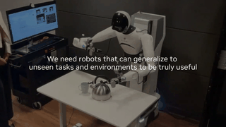
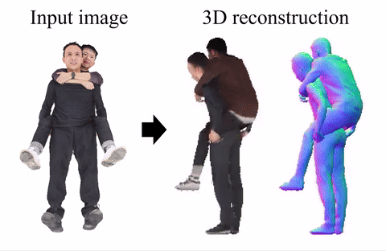
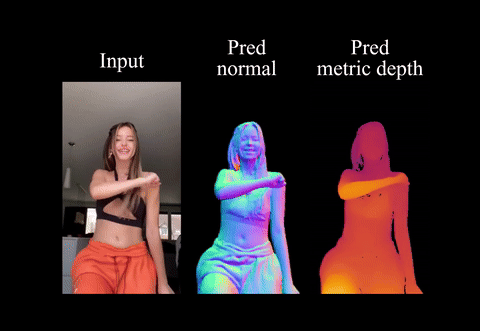
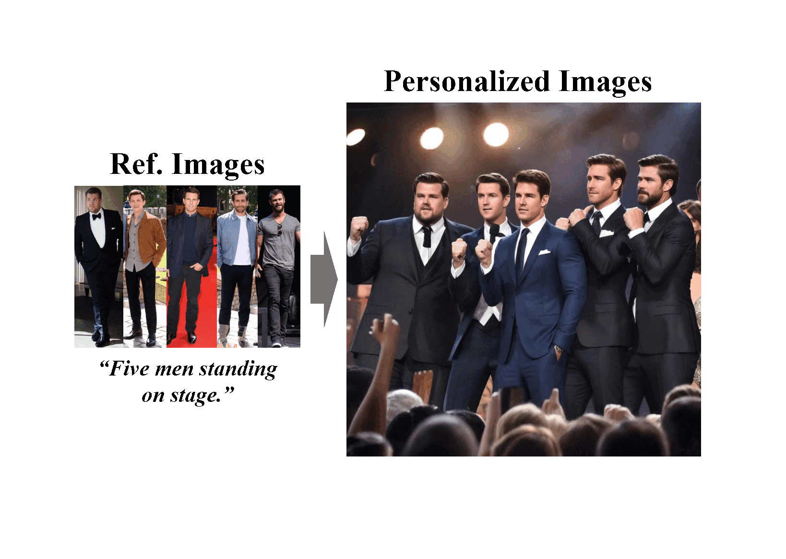
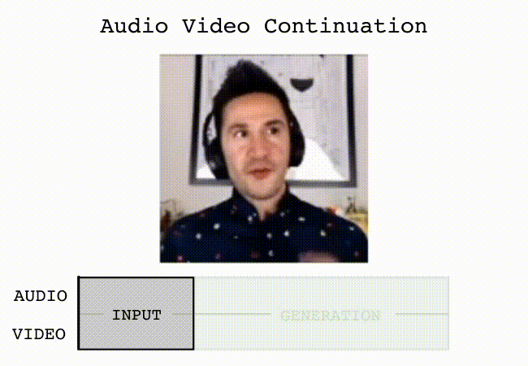
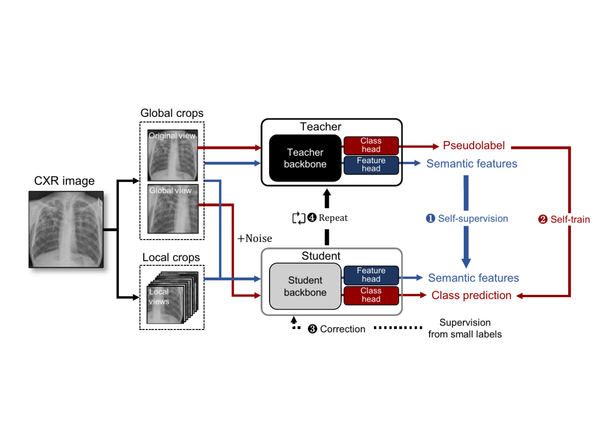
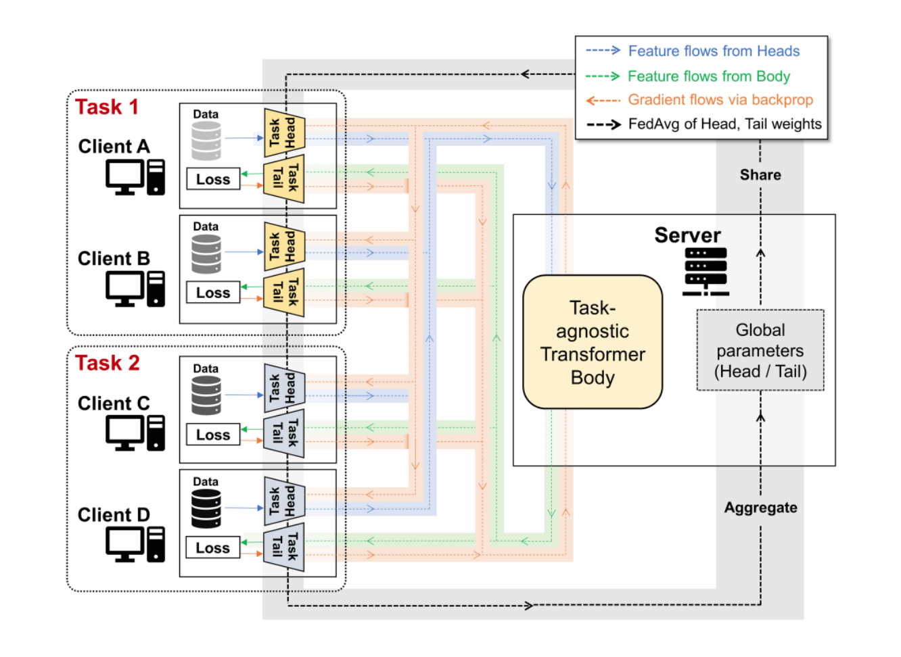
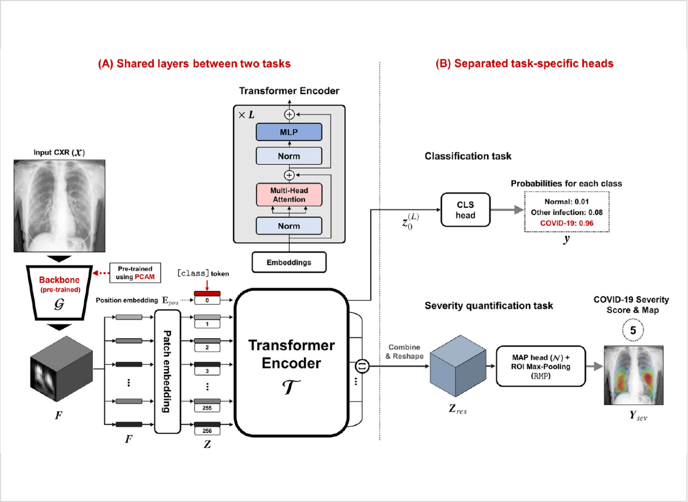

## About Me

I am a Research Scientist at [NVIDIA GEAR](https://research.nvidia.com/labs/gear/), working on robot foundation models and world models. My research focuses on unifying perception, prediction, and action for real-world embodied agents, building on my background in multimodal generative modeling of the physical world.

I received my Ph.D. in Electrical and Computer Engineering from [Seoul National University](https://en.snu.ac.kr/), advised by Prof. [Se Young Chun](https://icl.snu.ac.kr/pi), and my M.S. in Bio and Brain Engineering from [KAIST](https://www.kaist.ac.kr/en/), advised by Prof. [Jong Chul Ye](https://bispl.weebly.com/professor.html). During my Ph.D., I interned at [NVIDIA Research](https://www.nvidia.com/en-us/research/) and [Google Research](https://research.google/). My research has been supported by the [Qualcomm Innovation Fellowship](https://www.qualcomm.com/research/university-relations/innovation-fellowship/winners).

## News

<ul id="news-list">
<li><b>[Apr. 2026]</b> I joined <a href="https://research.nvidia.com/labs/gear/">NVIDIA GEAR</a> as a Research Scientist.</li>
<li><b>[Feb. 2026]</b> <a href="https://jongheean11.github.io/HUG3D_project/">HUG-3D</a> is accepted to <a href="https://cvpr.thecvf.com/Conferences/2026/">CVPR 2026</a> as a Highlight.</li>
<li><b>[Sep. 2025]</b> We won the 2nd place award in <a href="https://reg2025.grand-challenge.org">REG 2025</a>.</li>
<li><b>[Jun. 2025]</b> <a href="https://arxiv.org/abs/2505.23085">GeoMan</a> (NVIDIA) and <a href="https://arxiv.org/abs/2411.18068">PersonaCraft</a> are accepted to <a href="https://iccv.thecvf.com/">ICCV 2025</a>.</li>
<li><b>[Oct. 2024]</b> I won the <a href="https://buildyourfuture.withgoogle.com/scholarships/google-conference-scholarships">Google Conference Scholarship</a>.</li>
<li><b>[Sep. 2024]</b> <a href="https://arxiv.org/abs/2405.13762">AVDiT & MoNL</a> (Google) is accepted to <a href="https://neurips.cc/">NeurIPS 2024</a>.</li>
<li><b>[Jul. 2024]</b> <a href="https://arxiv.org/abs/2404.04544">BeyondScene</a> is accepted to <a href="https://eccv2024.ecva.net/">ECCV 2024</a>.</li>
<li><b>[Jan. 2024]</b> I joined <a href="https://www.nvidia.com/en-us/research/">NVIDIA</a> as a Research Intern.</li>
<li><b>[Nov. 2023]</b> I won the <a href="https://www.qualcomm.com/research/university-relations/innovation-fellowship/winners">Qualcomm Innovation Fellowship South Korea 2023</a>.</li>
<li><b>[Sep. 2023]</b> I joined <a href="https://research.google/">Google</a> as a Student Researcher.</li>
</ul>

<ul id="news-list">
<li><b>[Aug. 2023]</b> I am selected as a recipient of <a href="https://aiis.snu.ac.kr/bbs/board.php?bo_table=eng4_3">Yulchon AI Star Scholarships</a>.</li>
<li><b>[Jul. 2023]</b> <a href="https://arxiv.org/abs/2304.01900">PODIA-3D</a> is accepted to <a href="https://iccv2023.thecvf.com/">ICCV 2023</a>.</li>
<li><b>[Apr. 2023]</b> <a href="https://arxiv.org/abs/2304.02827">Ditto-NeRF</a> is available on arXiv.</li>
<li><b>[Feb. 2023]</b> <a href="https://openaccess.thecvf.com/content/CVPR2023/papers/Kim_DATID-3D_Diversity-Preserved_Domain_Adaptation_Using_Text-to-Image_Diffusion_for_3D_Generative_CVPR_2023_paper.pdf">DATID-3D</a> is accepted to <a href="https://cvpr2023.thecvf.com/">CVPR 2023</a>.</li>
<li><b>[Aug. 2022]</b> <a href="https://openaccess.thecvf.com/content/CVPR2022/html/Kim_DiffusionCLIP_Text-Guided_Diffusion_Models_for_Robust_Image_Manipulation_CVPR_2022_paper.html">DiffusionCLIP</a> is invited to oral session at <a href="http://kccv2022.kcvs.kr/">KCCV 2022</a>.</li>
<li><b>[Jun. 2022]</b> <a href="https://www.nature.com/articles/s41467-022-31514-x">DISTL</a> is accepted to <a href="https://www.nature.com/ncomms/">Nature Communications</a>.</li>
<li><b>[Mar. 2022]</b> <a href="https://openaccess.thecvf.com/content/CVPR2022/html/Kim_DiffusionCLIP_Text-Guided_Diffusion_Models_for_Robust_Image_Manipulation_CVPR_2022_paper.html">DiffusionCLIP</a> is accepted to <a href="https://cvpr2022.thecvf.com/">CVPR 2022</a>.</li>
<li><b>[Dec. 2021]</b> I won the <a href="https://bispl.weebly.com/bispl-hall-of-fame">Best Master Student for the Year Award</a> at <a href="https://bispl.weebly.com/">BISPL</a>, KAIST.</li>
<li><b>[Sep. 2021]</b> <a href="https://papers.nips.cc/paper/2021/file/ceb0595112db2513b9325a85761b7310-Paper.pdf">FeSTA</a> is accepted to <a href="https://neurips.cc/Conferences/2021">NeurIPS 2021</a>.</li>
<li><b>[Dec. 2020]</b> We won the 2nd place award in <a href="https://dreamai.kr/fair_nvidia">NVIDIA AI Healthcare Hackathon</a>.</li>
</ul>

<a id="toggle-news" onclick="toggleNews()" style="cursor:pointer;">Show More</a>

## Selected Research

<ol class="bibliography">

<li>

  

    
  

  

      
<a href="https://arxiv.org/abs/2602.15922"> World Action Models are Zero-Shot Policies</a>

      
S. Ye*, Y. Ge, K. Zheng, S. Gao, S. Yu, ..., <strong>Gwanghyun Kim</strong>, ..., Y. Chebotar, S. Reed, J. Kautz, Y. Zhu*, J. Fan*, J. Jang* (*leads)

    
<em><strong>arXiv 2026, NVIDIA</strong></em>
      

    

      <a href="https://arxiv.org/pdf/2602.15922" class="btn btn-sm z-depth-0" role="button" target="_blank" style="font-size:12px;">PDF</a>
      <a href="https://dreamzero0.github.io/" class="btn btn-sm z-depth-0" role="button" target="_blank" style="font-size:12px;">Project page</a>
      <a href="https://github.com/dreamzero0/dreamzero" class="btn btn-sm z-depth-0" role="button" target="_blank" style="font-size:12px;">Code</a>
    

  

</li>

<li>

  

    
    <abbr class="badge">CVPR Highlight</abbr>
  

  

      
<a href="https://arxiv.org/abs/2604.05436">Human Interaction-Aware 3D Reconstruction from a Single Image</a>

      
<strong>Gwanghyun Kim*</strong>, J. J. Kim*, S. Y. Jeon*, J. Park, S. Y. Chun (*co-first authors) 

    
<em><strong>CVPR 2026 (Highlight)</strong></em>
      

    

      <a href="https://arxiv.org/pdf/2604.05436" class="btn btn-sm z-depth-0" role="button" target="_blank" style="font-size:12px;">PDF</a>
      <a href="https://jongheean11.github.io/HUG3D_project/" class="btn btn-sm z-depth-0" role="button" target="_blank" style="font-size:12px;">Project page</a>
    

  

</li>

<li>

  

    
    <abbr class="badge">ICCV</abbr>
  

  

      
<a href="https://arxiv.org/abs/2505.23085">GeoMan: Temporally Consistent Human Geometry Estimation using Image-to-Video Diffusion</a>

      
<strong>Gwanghyun Kim</strong>,  X. Li, Y. Yuan, K. Nagano, T. Li, J. Kautz, S. Y. Chun, U. Iqbal 

    
<em><strong>ICCV 2025, NVIDIA</strong></em>
      

    

      <a href="https://arxiv.org/pdf/2505.23085" class="btn btn-sm z-depth-0" role="button" target="_blank" style="font-size:12px;">PDF</a>
      <a href="https://research.nvidia.com/labs/dair/geoman" class="btn btn-sm z-depth-0" role="button" target="_blank" style="font-size:12px;">Project page</a>
    

  

</li>

<li>

  

    
    <abbr class="badge">ICCV</abbr>
  

  

      
<a href="https://arxiv.org/abs/2411.18068">PersonaCraft: Personalized and Controllable Full-Body Multi-Human Scene Generation Using Occlusion-Aware 3D-Conditioned Diffusion</a>

      
<strong>Gwanghyun Kim*</strong>,  S. Y. Jeon*, S. Lee, S. Y. Chun <strong>(*co-first)</strong> 

    
<em><strong>ICCV 2025</strong></em>
      

    

      <a href="https://arxiv.org/pdf/2411.18068" class="btn btn-sm z-depth-0" role="button" target="_blank" style="font-size:12px;">PDF</a>
      <a href="https://gwang-kim.github.io/persona_craft/" class="btn btn-sm z-depth-0" role="button" target="_blank" style="font-size:12px;">Project page</a>
      <a href="https://github.com/gwang-kim/PersonaCraft" class="btn btn-sm z-depth-0" role="button" target="_blank" style="font-size:12px;">Code</a>
    

  

</li>

<li>

  

    
    <abbr class="badge">NeurIPS</abbr>
  

  

      
<a href="https://arxiv.org/abs/2405.13762">A Versatile Diffusion Transformer with Mixture of Noise Levels for Audiovisual Generation</a>

      
<strong>Gwanghyun Kim*</strong>,  A. Martinez, Y. Su, B. Jou, J. Lezama, A. Gupta, L. Yu, L. Jiang, A. Jansen, J. Walker, K. Somandepalli* <strong>(*co-first)</strong> 

      
<em><strong>NeurIPS 2024, Google</strong></em>
      

    

      <a href="https://arxiv.org/pdf/2405.13762" class="btn btn-sm z-depth-0" role="button" target="_blank" style="font-size:12px;">PDF</a>
      <a href="https://avdit2024.github.io/" class="btn btn-sm z-depth-0" role="button" target="_blank" style="font-size:12px;">Project page</a>
    

  

</li>

<li>

  

    
    <abbr class="badge">ECCV</abbr>
  

  

      
<a href="https://arxiv.org/abs/2404.04544">BeyondScene: Higher-Resolution Human-Centric Scene Generation With Pretrained Diffusion</a>

      
<strong>Gwanghyun Kim*</strong>,  H. Kim*, H. Seo*, D U Kang*,  S. Y. Chun <strong>(*co-first)</strong> 

      
<em><strong>ECCV 2024</strong></em>
      

    

      <a href="https://arxiv.org/pdf/2404.04544.pdf" class="btn btn-sm z-depth-0" role="button" target="_blank" style="font-size:12px;">PDF</a>
      <a href="https://janeyeon.github.io/beyond-scene/" class="btn btn-sm z-depth-0" role="button" target="_blank" style="font-size:12px;">Project page</a>
      <a href="https://github.com/BeyondScene/BeyondScene" class="btn btn-sm z-depth-0" role="button" target="_blank" style="font-size:12px;">Code</a>
    

  

</li>

<li>

  

    
    <abbr class="badge">ICCV</abbr>
  

  

      
<a href="https://arxiv.org/abs/2304.01900">PODIA-3D: Domain Adaptation of 3D Generative Model Across Large Domain Gap Using Pose-Preserved Text-to-Image Diffusion</a>

      
<strong>Gwanghyun Kim</strong>, J. H. Jang, S. Y. Chun 

      
<em><strong>ICCV 2023</strong></em>
      

    

      <a href="https://arxiv.org/pdf/2304.01900.pdf" class="btn btn-sm z-depth-0" role="button" target="_blank" style="font-size:12px;">PDF</a>
      <a href="https://gwang-kim.github.io/podia_3d/" class="btn btn-sm z-depth-0" role="button" target="_blank" style="font-size:12px;">Project page</a>
      <a href="https://github.com/gwang-kim/PODIA-3D" class="btn btn-sm z-depth-0" role="button" target="_blank" style="font-size:12px;">Code</a>
    

  

</li>

<li>

  

    
    <abbr class="badge">CVPR</abbr>
  

  

      
<a href="https://openaccess.thecvf.com/content/CVPR2023/papers/Kim_DATID-3D_Diversity-Preserved_Domain_Adaptation_Using_Text-to-Image_Diffusion_for_3D_Generative_CVPR_2023_paper.pdf">DATID-3D: Diversity-Preserved Domain Adaptation Using Text-to-Image Diffusion for 3D Generative Model</a>

      
<strong>Gwanghyun Kim</strong>, S. Y. Chun 

      
<em><strong>CVPR 2023</strong></em>
      

    

      <a href="https://openaccess.thecvf.com/content/CVPR2023/papers/Kim_DATID-3D_Diversity-Preserved_Domain_Adaptation_Using_Text-to-Image_Diffusion_for_3D_Generative_CVPR_2023_paper.pdf" class="btn btn-sm z-depth-0" role="button" target="_blank" style="font-size:12px;">PDF</a>
      <a href="https://gwang-kim.github.io/datid_3d/" class="btn btn-sm z-depth-0" role="button" target="_blank" style="font-size:12px;">Project page</a>
      <a href="https://github.com/gwang-kim/DATID-3D" class="btn btn-sm z-depth-0" role="button" target="_blank" style="font-size:12px;">Code</a>
      <a href="https://huggingface.co/spaces/gwang-kim/DATID-3D" class="btn btn-sm z-depth-0" role="button" target="_blank" style="font-size:12px;">Demo</a>
      <a href="https://github.com/gwang-kim/DATID-3D" target="_blank" rel="noopener"><strong><i style="color:#e74d3c; font-weight:600" id="githubstars_manets2"></i><i style="color:#e74d3c; font-weight:600"> GitHub Stars</i></strong></a>
    
    

  

</li>

<li>

  

    
  

  

      
<a href="https://arxiv.org/abs/2304.02827">DITTO-NeRF: Diffusion-based Iterative Text To Omni-directional 3D Model </a>

      
H. Seo*, H. Kim*, <strong>Gwanghyun Kim*</strong>, S. Y. Chun <strong>(*co-first)</strong> 

      
<em><strong>arxiv 2023</strong></em>
      

    

      <a href="https://arxiv.org/pdf/2304.02827.pdf" class="btn btn-sm z-depth-0" role="button" target="_blank" style="font-size:12px;">PDF</a>
      <a href="https://janeyeon.github.io/ditto-nerf" class="btn btn-sm z-depth-0" role="button" target="_blank" style="font-size:12px;">Project page</a>
      <a href="https://github.com/janeyeon/ditto-nerf-code" class="btn btn-sm z-depth-0" role="button" target="_blank" style="font-size:12px;">Code</a>
    

  

</li>

<li>

  

    
            <abbr class="badge">CVPR</abbr>
  

  

      
<a href="https://openaccess.thecvf.com/content/CVPR2022/papers/Kim_DiffusionCLIP_Text-Guided_Diffusion_Models_for_Robust_Image_Manipulation_CVPR_2022_paper.pdf">DiffusionCLIP: Text-Guided Diffusion Models for Robust Image Manipulation</a>

      
<strong>Gwanghyun Kim</strong>, T. Kwon, J. C. Ye 

      
<em><strong>CVPR 2022</strong></em>
      

    

      <a href="https://openaccess.thecvf.com/content/CVPR2022/papers/Kim_DiffusionCLIP_Text-Guided_Diffusion_Models_for_Robust_Image_Manipulation_CVPR_2022_paper.pdf" class="btn btn-sm z-depth-0" role="button" target="_blank" style="font-size:12px;">PDF</a>
      <a href="https://github.com/gwang-kim/DiffusionCLIP" class="btn btn-sm z-depth-0" role="button" target="_blank" style="font-size:12px;">Code</a>
      <a href="https://replicate.com/gwang-kim/diffusionclip" class="btn btn-sm z-depth-0" role="button" target="_blank" style="font-size:12px;">Demo</a>
      <a href="https://github.com/gwang-kim/DiffusionCLIP" target="_blank" rel="noopener"><strong><i style="color:#e74d3c; font-weight:600" id="githubstars_manets"></i><i style="color:#e74d3c; font-weight:600"> GitHub Stars</i></strong></a>
  
    

  

</li>

<li>

  

    
    <abbr class="badge">Nat. Commun.</abbr>
  

  

      
<a href="https://www.nature.com/articles/s41467-022-31514-x">AI can evolve without labels: self-evolving vision transformer for chest X-ray diagnosis through knowledge distillation</a>

      
S. Park, <strong>Gwanghyun Kim</strong>, Y. Oh, J. B. Seo, S. M. Lee, J. H. Kim, S. Moon, J. K. Lim,  C. M. Park, J. C. Ye 

      
<em><strong>Nature Communications, 2022 </strong></em>
      

    

      <a href="https://www.nature.com/articles/s41467-022-31514-x" class="btn btn-sm z-depth-0" role="button" target="_blank" style="font-size:12px;">PDF</a>
    

  

</li>

<li>

  

    
    <abbr class="badge">NeurIPS</abbr>
  

  

      
<a href="https://papers.nips.cc/paper/2021/file/ceb0595112db2513b9325a85761b7310-Paper.pdf">Federated Split Vision Transformer for COVID-19 CXR Diagnosis using Task-Agnostic Training</a>

      
S. Park*, <strong>Gwanghyun Kim*</strong>, J. Kim, B. Kim, J. C. Ye <strong>(*co-first)</strong> 

      
<em><strong>NeurIPS 2021 </strong></em>
      

    

      <a href="https://papers.nips.cc/paper/2021/file/ceb0595112db2513b9325a85761b7310-Paper.pdf" class="btn btn-sm z-depth-0" role="button" target="_blank" style="font-size:12px;">PDF</a>
    

  

</li>

<li>

  

    
    <abbr class="badge">Med. Image Anal.</abbr>
  

  

      
<a href="https://www.sciencedirect.com/science/article/pii/S1361841521003443">Multi-task Vision Transformer using Low-level Chest X-ray Feature Corpus for COVID-19 Diagnosis and Severity Quantification</a>

      
S. Park*, <strong>Gwanghyun Kim*</strong>, Y. Oh, J. B. Seo, S. M. Lee, J. H. Kim, S. Moon, J. K. Lim, J. C. Ye <strong>(*co-first)</strong> 

      
<em><strong>Medical Image Analysis, 2021 </strong></em>
      

    

      <a href="https://www.sciencedirect.com/science/article/pii/S1361841521003443" class="btn btn-sm z-depth-0" role="button" target="_blank" style="font-size:12px;">PDF</a>
    

  

</li>

</ol>

