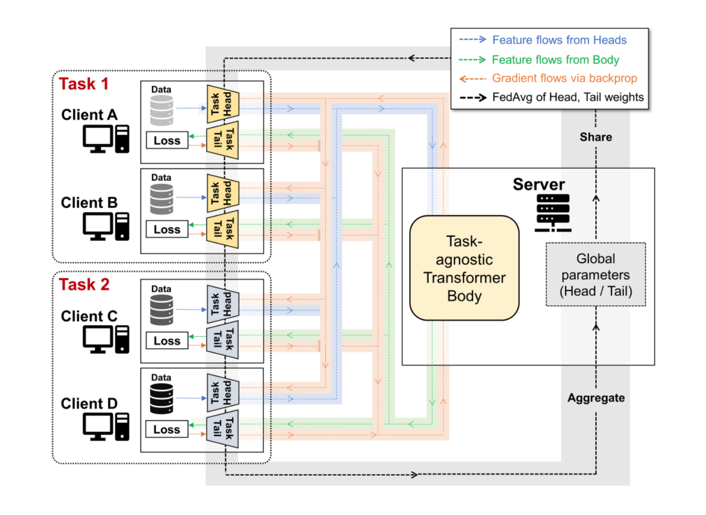

## Welcome! 

I am a second-year Ph.D. student in electrical and computer engineering (ECE) at Seoul National University (SNU), advised by Prof. [Se Young Chun](https://icl.snu.ac.kr/pi).
  I completed my M.S. in Bio and Brain Engineering (BBE)  at Korea Advanced Institute of Science and Technology (KAIST), advised by Prof. [Jong Chul Ye](https://bispl.weebly.com/professor.html).
I earned my B.S degree in electrical and electronic engineering (EEE) from Yonsei University, advised by Prof. [Dong Hyun Kim](http://kimchi.yonsei.ac.kr/default/01/01.php#s1).

## Research Interests
My research interests lie broadly in the field of computer vision (CV), machine learning (ML), medical imaging (MI) and signal processing (SP). Specifically, my work explores the following areas:
- **Generative models** and their applications (Diffusion models, GANs)
- **Multi-modal learning** (Text-to-Image, Text-to-Video, Speech-to-Image)  
- **3D reconstruction and 3D-aware synthesis** 
- **Privacy-preserving distributed learning** (Federated learning, Split learning)
- **Weakly- and Self-supervised learning**
- **Transformers for vision** and their applications

but not limited to.

## <b style="color:#F88017">News</b>

- **[Apr. 2023]** [Paper](https://arxiv.org/pdf/2304.01900.pdf) on text-guided adaptation of 3D generative model across large domain gap is available on arXiv.
- **[Apr. 2023]** [Paper](https://arxiv.org/pdf/2304.02827.pdf) on text-to-3D & image-to-3D is available on arXiv.
- **[Feb. 2023]** [Paper](https://arxiv.org/pdf/2211.16374.pdf) on diverse-preserved text-guided domain adaptation for 3D generative models was accepted to [CVPR 2023](https://cvpr2023.thecvf.com/).
- **[Nov. 2022]** I started a new postiion as [Lecturer in AI](https://fastcampus.co.kr/data_online_ganmodel) at [FastCampus](https://fastcampus.co.kr/).
- **[Aug. 2022]** I had a presentation on "Diffusion Models for Vision-Language" at [Kakao Brain Open Seminar](https://www.kakaobrain.com/).
- **[Aug. 2022]** [DiffusionCLIP](https://openaccess.thecvf.com/content/CVPR2022/html/Kim_DiffusionCLIP_Text-Guided_Diffusion_Models_for_Robust_Image_Manipulation_CVPR_2022_paper.html) was invited to oral session at [KCCV 2022](http://kccv2022.kcvs.kr/).
- **[Jun. 2022]** [Paper](https://www.nature.com/articles/s41467-022-31514-x) on self-supervision and self-training on CXR using ViT was accepted to [Nature Communications](https://www.nature.com/ncomms/aims?gclid=Cj0KCQjwzLCVBhD3ARIsAPKYTcRgreQTZQgfNQoa9T20b_DFX47TpljFwkD09uQTo00ca6hwEV4eqcEaAh1_EALw_wcB).
- **[Mar. 2022]** [Paper](https://openaccess.thecvf.com/content/CVPR2022/html/Kim_DiffusionCLIP_Text-Guided_Diffusion_Models_for_Robust_Image_Manipulation_CVPR_2022_paper.html) on text-guided diffusion models for robust image manipulation was accepted to [CVPR 2022](https://cvpr2022.thecvf.com/).
- **[Dec. 2021]** I won the [Best Master Student for the Year Award](https://bispl.weebly.com/bispl-hall-of-fame) at [BISPL](https://bispl.weebly.com/), KAIST.
- **[Dec. 2021]** [AI-based COVID-19 diagnosis solution](https://www.promedius.ai/product/1) based on our [paper](https://www.sciencedirect.com/science/article/pii/S1361841521003443) passed the exploratory clinical trial by [MFDS](https://www.mfds.go.kr/eng/index.do), Korea.
- **[Nov. 2021]** [Paper](https://www.sciencedirect.com/science/article/pii/S1361841521003443) on ViT for COVID-19 was accepted to [Medical Image Analysis](https://www.journals.elsevier.com/medical-image-analysis).
- **[Sep. 2021]** [Paper](https://papers.nips.cc/paper/2021/file/ceb0595112db2513b9325a85761b7310-Paper.pdf) on distributed learning was accepted to [NeurIPS 2021](https://neurips.cc/Conferences/2021).
- **[Dec. 2020]** We won 2nd place award in [NVIDIA AI Healthcare Hackathon](https://dreamai.kr/fair_nvidia).

## Research

<ol class="bibliography">

<li>

  

    
  

  

      
<a href="https://arxiv.org/pdf/2304.01900.pdf">PODIA-3D: Domain Adaptation of 3D Generative Model Across Large Domain Gap Using Pose-Preserved Text-to-Image Diffusion</a>

      
<strong>Gwanghyun Kim</strong>, J. H. Jang, S. Y. Chun 

      
<em><strong>arXiv, 2023</strong></em>
      

    

      <a href="https://arxiv.org/pdf/2304.01900.pdf" class="btn btn-sm z-depth-0" role="button" target="_blank" style="font-size:12px;">PDF</a>
      <a href="https://gwang-kim.github.io/podia_3d/" class="btn btn-sm z-depth-0" role="button" target="_blank" style="font-size:12px;">Project page</a>
      <a href="https://github.com/gwang-kim/PODIA-3D" class="btn btn-sm z-depth-0" role="button" target="_blank" style="font-size:12px;">Code</a>
    

  

</li>

<li>

  

    
  

  

      
<a href="https://arxiv.org/pdf/2304.02827.pdf">DITTO-NeRF: Diffusion-based Iterative Text To Omni-directional 3D Model </a>

      
H. Seo*, H. Kim*, <strong>Gwanghyun Kim*</strong>, S. Y. Chun <strong>(*co-first)</strong> 

      
<em><strong>arXiv, 2023</strong></em>
      

    

      <a href="https://arxiv.org/pdf/2304.02827.pdf" class="btn btn-sm z-depth-0" role="button" target="_blank" style="font-size:12px;">PDF</a>
      <a href="https://janeyeon.github.io/ditto-nerf" class="btn btn-sm z-depth-0" role="button" target="_blank" style="font-size:12px;">Project page</a>
      <a href="https://github.com/janeyeon/ditto-nerf-code" class="btn btn-sm z-depth-0" role="button" target="_blank" style="font-size:12px;">Code</a>
    

  

</li>

<li>

  

    
    <abbr class="badge">CVPR</abbr>
  

  

      
<a href="https://arxiv.org/pdf/2211.16374.pdf">DATID-3D: Diversity-Preserved Domain Adaptation Using Text-to-Image Diffusion for 3D Generative Model</a>

      
<strong>Gwanghyun Kim</strong>, S. Y. Chun 

      
<em><strong>CVPR 2023</strong></em>
      

    

      <a href="https://arxiv.org/pdf/2211.16374.pdf" class="btn btn-sm z-depth-0" role="button" target="_blank" style="font-size:12px;">PDF</a>
      <a href="https://gwang-kim.github.io/datid_3d/" class="btn btn-sm z-depth-0" role="button" target="_blank" style="font-size:12px;">Project page</a>
      <a href="https://github.com/gwang-kim/DATID-3D" class="btn btn-sm z-depth-0" role="button" target="_blank" style="font-size:12px;">Code</a>
      
      <a href="https://github.com/gwang-kim/DATID-3D" target="_blank" rel="noopener"><strong><i style="color:#e74d3c; font-weight:600" id="githubstars_manets2"></i><i style="color:#e74d3c; font-weight:600"> GitHub Stars</i></strong></a>
    
    

  

</li>

<li>

  

    
    <abbr class="badge">Nat. Commun.</abbr>
  

  

      
<a href="https://www.nature.com/articles/s41467-022-31514-x">AI can evolve without labels: self-evolving vision transformer for chest X-ray diagnosis through knowledge distillation</a>

      
S. Park, <strong>Gwanghyun Kim</strong>, Y. Oh, J. B. Seo, S. M. Lee, J. H. Kim, S. Moon, J. K. Lim,  C. M. Park, J. C. Ye 

      
<em><strong>Nature Communications, 2022 </strong></em><strong>(IF: 17.694)</strong>
      

    

      <a href="https://www.nature.com/articles/s41467-022-31514-x" class="btn btn-sm z-depth-0" role="button" target="_blank" style="font-size:12px;">PDF</a>
    

  

</li>

<li>

  

    
            <abbr class="badge">CVPR</abbr>
  

  

      
<a href="https://arxiv.org/pdf/2110.02711.pdf">DiffusionCLIP: Text-Guided Diffusion Models for Robust Image Manipulation</a>

      
<strong>Gwanghyun Kim</strong>, T. Kwon, J. C. Ye 

      
<em><strong>CVPR 2022</strong></em>
      

    

      <a href="https://arxiv.org/pdf/2110.02711.pdf" class="btn btn-sm z-depth-0" role="button" target="_blank" style="font-size:12px;">PDF</a>
      <a href="https://github.com/gwang-kim/DiffusionCLIP" class="btn btn-sm z-depth-0" role="button" target="_blank" style="font-size:12px;">Code</a>
      <a href="https://replicate.com/gwang-kim/diffusionclip" class="btn btn-sm z-depth-0" role="button" target="_blank" style="font-size:12px;">Demo</a>
      
      <a href="https://youtu.be/YVCtaXw6fw8" class="btn btn-sm z-depth-0" role="button" target="_blank" style="font-size:12px;">Video</a>
      <a href="https://drive.google.com/file/d/1QgRFIRba492dCZ6v7BcZB9zqyp91aTjL/view?usp=sharing" class="btn btn-sm z-depth-0" role="button" target="_blank" style="font-size:12px;">Poster</a>
      <a href="https://github.com/gwang-kim/DiffusionCLIP" target="_blank" rel="noopener"><strong><i style="color:#e74d3c; font-weight:600" id="githubstars_manets"></i><i style="color:#e74d3c; font-weight:600"> GitHub Stars</i></strong></a>
  
    

  

</li>

<li>

  

    
    <abbr class="badge">NeurIPS</abbr>
  

  

      
<a href="https://papers.nips.cc/paper/2021/file/ceb0595112db2513b9325a85761b7310-Paper.pdf">Federated Split Vision Transformer for COVID-19 CXR Diagnosis using Task-Agnostic Training</a>

      
S. Park*, <strong>Gwanghyun Kim*</strong>, J. Kim, B. Kim, J. C. Ye <strong>(*co-first)</strong> 

      
<em><strong>NeurIPS 2021 </strong></em>
      

    

      <a href="https://papers.nips.cc/paper/2021/file/ceb0595112db2513b9325a85761b7310-Paper.pdf" class="btn btn-sm z-depth-0" role="button" target="_blank" style="font-size:12px;">PDF</a>
    

  

</li>

<li>

  

    
    <abbr class="badge">Med. Image Anal.</abbr>
  

  

      
<a href="https://www.sciencedirect.com/science/article/pii/S1361841521003443">Multi-task Vision Transformer using Low-level Chest X-ray Feature Corpus for COVID-19 Diagnosis and Severity Quantification</a>

      
S. Park*, <strong>Gwanghyun Kim*</strong>, Y. Oh, J. B. Seo, S. M. Lee, J. H. Kim, S. Moon, J. K. Lim, J. C. Ye <strong>(*co-first)</strong> 

      
<em><strong>Medical Image Analysis, 2021 </strong></em><strong>(IF: 13.828)</strong>
      

    

      <a href="https://www.sciencedirect.com/science/article/pii/S1361841521003443" class="btn btn-sm z-depth-0" role="button" target="_blank" style="font-size:12px;">PDF</a>
    

  

</li>

<li>

  

    
  

  

      
<a href="https://arxiv.org/pdf/2103.07062.pdf">Severity Quantification and Lesion Localization of COVID-19 on CXR using Vision Transformer</a>

      
<strong>Gwanghyun Kim</strong>, S. Park, Y. Oh, J. B. Seo, S. M. Lee, J. H. Kim, S. Moon, J. K. Lim, J. C. Ye 

      
<em><strong>arXiv, 2021</strong></em>
      

    

      <a href="https://arxiv.org/pdf/2103.07062.pdf" class="btn btn-sm z-depth-0" role="button" target="_blank" style="font-size:12px;">PDF</a>
    

  

</li>

<li>

  

    
  

  

      
<a href="https://arxiv.org/pdf/2103.07055.pdf">Vision Transformer for COVID-19 CXR Diagnosis using Chest X-ray Feature Corpus</a>

      
S. Park, <strong>Gwanghyun Kim</strong>, Y. Oh, J. B. Seo, S. M. Lee, J. H. Kim, S. Moon, J. K. Lim, J. C. Ye 

      
<em><strong>arXiv, 2021</strong></em>
      

    

      <a href="https://arxiv.org/pdf/2103.07055.pdf" class="btn btn-sm z-depth-0" role="button" target="_blank" style="font-size:12px;">PDF</a>
    

  

</li>

</ol>

## Experience

- **Lecturer in AI**
   
  Fast Campus, Seoul, Korea, 2022 -
   
  Letcure title: [Mastering GANs through Model Implementation](https://fastcampus.co.kr/data_online_ganmodel)

## Patents

- **Severity quantification and lesion localization method of infectious disease on cxr using vision transformer and apparatus therefor**
   
  J. C. Ye, S. Park, **Gwanghyun Kim**
   
  U.S. Patent Application, No. 17/704,879, 2022

- **Method of classifying lesion of chest x-ray radiograph based on data normalization and local patch and apparatus thereof**
   
  J. C. Ye, S. Park, Y. Oh, **Gwanghyun Kim**
   
  U.S. Patent Application, No. 17/352,229, 2022

## Awards and Honors

[//]: # (- **Brain Korea 21 &#40;BK21&#41; Scholarships**, Korea Research Foundation, 2022 -)
- **Best Master Student for the Year Award**, BISPL, KAIST, 2021
- **2nd Place Award in NVIDIA AI Healthcare Hackathon**, 2020
- **KAIST Scholarship**, KAIST, 2020 - 2021
- **Honors Scholarship**, Yonsei University, Spring 2018, Fall 2018
  
## Invited Talks

- **DiffusionCLIP: Text-Guided Diffusion Models for Robust Image Manipulation**
   
  London Machine Learning Meetup, Online, 2022

- **Diffusion Models for Vision-Language Tasks**
   
  Kakao Brain Open Seminar, Kakao Brain, 2022

- **Deep Learning based Diagnosis of Infectious Diseases on CXR and Audio data**
   
  NVIDIA AI Developer Meetup, Online, 2021

[//]: # (## Teaching)

[//]: # ()
[//]: # (- **Generative Adversarial Networks**)

[//]: # (   )

[//]: # (  Fast Campus, Online, 2022-2023)

[//]: # (## Services)

[//]: # ()
[//]: # (<h4 style="margin:0 10px 0;">Reviewers</h4>)

[//]: # (<ul style="margin:0 0 20px;">)

[//]: # (  <li><a href="https://www.computer.org/csdl/journal/tp"><autocolor>IEEE Transactions on Pattern Analysis and Machine Intelligence &#40;TPAMI&#41;</autocolor></a></li>)

[//]: # (<li><a href="http://cvpr2023.thecvf.com/"><autocolor>IEEE/CVF Conference on Computer Vision and Pattern Recognition &#40;CVPR&#41; 2023</autocolor></a></li>)

[//]: # (</ul>)

## Services
- **Reviewers:** T-PAMI, ACM Comput Surv, CVPR 2023 

## Projects

- **Development of AI Modules for Smart X-ray Screening Systems**
   
  Conducted by Korea Customs Service, 2021 - 2021
   
  Algorithm development

- **AI Chest X-ray Rapid Diagnosis**
   
  Conducted by Korea Aid for Respiratory Epidemic, 2020 - 2021
   
  Algorithm development, System deployment, Clinical trial preparation

