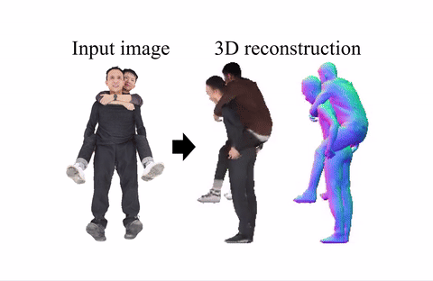
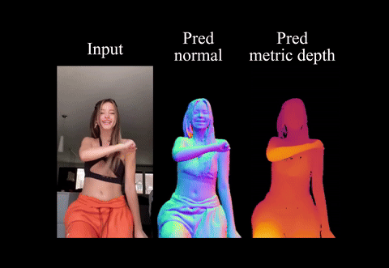

## Welcome!
I am a Ph.D. candidate in electrical and computer engineering (ECE) at Seoul National University (SNU), advised by Prof. [Se Young Chun](https://icl.snu.ac.kr/pi).
  I completed my M.S. in Bio and Brain Engineering (BBE) at Korea Advanced Institute of Science and Technology (KAIST), advised by Prof. [Jong Chul Ye](https://bispl.weebly.com/professor.html).
I earned my B.S degree in electrical and electronic engineering (EEE) from Yonsei University, advised by Prof. [Dong Hyun Kim](http://kimchi.yonsei.ac.kr/default/01/01.php#s1).

## Experience
- **NVIDIA Research**, Research Scientist Intern
   
  Mentors: [Umar Iqbal](https://www.umariqbal.info/), [Xueting Li](https://sunshineatnoon.github.io/), [Ye Yuan](https://ye-yuan.com/),  [Koki Nagano](https://luminohope.org), and [Tianye Li](https://research.nvidia.com/labs/amri/author/tianye-li)
   
  Jan. 2024 - Feb. 2025, Santa Clara, CA (remote)
- **Google Research**, Student Researcher
   
  Hosts: [Alonso Martinez](https://www.linkedin.com/in/alonsomartinez/), [Krishna Somandepalli](https://sail.usc.edu/~somandep/), and [Yu-Chuan Su](https://sammy-su.github.io/)
   
  Sep. 2023 - Jan. 2024, New York, NY
- **Fast Campus**, Lecturer in AI
   
  Letcure title: [Mastering GANs through Model Implementation](https://fastcampus.co.kr/data_online_ganmodel)
   
  Nov. 2022 - Oct. 2023, Seoul, Korea

## Research Interests
My research focuses on artificial intelligence (AI), particularly in computer vision (CV) and its intersection with **Generative AI**. I'm driven to leverage Generative AI's capabilities to tackle complex problems. My work explores three key areas:
- **Multimodal Generative AI** (Image, Video, Text, Audio, Depth, Normal, Motion, 3D)
- **High-Dimensional Generative AI** (>8K image, Video, 3D, 4D)
- **Human-Centric Generative AI** (Human face, Digital humans, Human-centric scene)

Also, I'm interested in distributed learning (federated/split learning), and weakly- and self-supervised learning.

## <b style="color:#F88017">News</b>
- **[Jun.  2025]** [GeoMan](https://arxiv.org/abs/2505.23085), done at [NVIDIA](https://www.nvidia.com/en-us/research/), and [PersonaCraft](https://arxiv.org/abs/2411.18068) are accepted to [ICCV 2025](https://iccv.thecvf.com/).
- **[Oct. 2024]** I won the [Google Conference Scholarship](https://buildyourfuture.withgoogle.com/scholarships/google-conference-scholarships).
- **[Sep. 2024]** [AVDiT & MoNL](https://arxiv.org/abs/2405.13762), done at Google, is accepted to [NeurIPS 2024](https://neurips.cc/).
- **[Jul. 2024]** [BeyondScene](https://arxiv.org/abs/2404.04544) is accepted to [ECCV 2024](https://eccv2024.ecva.net/).
- **[Jan. 2024]** I joined [NVIDIA](https://www.nvidia.com/en-us/research/) as a Research Intern.
- **[Nov. 2023]** I won the [Qualcomm Innovation Fellowship South Korea 2023](https://www.qualcomm.com/research/university-relations/innovation-fellowship/winners).
- **[Sep. 2023]** I joined [Google](https://research.google/) as a Student Researcher.
- **[Aug. 2023]** I am selected as a recipient of [Yulchon AI Star Scholarships](https://aiis.snu.ac.kr/bbs/board.php?bo_table=eng4_3). 
- **[Jul. 2023]** [PODIA-3D](https://arxiv.org/abs/2304.01900) is accepted to [ICCV 2023](https://iccv2023.thecvf.com/).
- **[Apr. 2023]** [Ditto-NeRF](https://arxiv.org/abs/2304.02827) is available on arXiv.
- **[Feb. 2023]** [DATID-3D](https://openaccess.thecvf.com/content/CVPR2023/papers/Kim_DATID-3D_Diversity-Preserved_Domain_Adaptation_Using_Text-to-Image_Diffusion_for_3D_Generative_CVPR_2023_paper.pdf) is accepted to [CVPR 2023](https://cvpr2023.thecvf.com/).
- **[Nov. 2022]** I start a new postiion as [Lecturer in AI](https://fastcampus.co.kr/data_online_ganmodel) at [Fast Campus](https://fastcampus.co.kr/).
- **[Aug. 2022]** [DiffusionCLIP](https://openaccess.thecvf.com/content/CVPR2022/html/Kim_DiffusionCLIP_Text-Guided_Diffusion_Models_for_Robust_Image_Manipulation_CVPR_2022_paper.html) is invited to oral session at [KCCV 2022](http://kccv2022.kcvs.kr/).
- **[Jun. 2022]** [DISTL](https://www.nature.com/articles/s41467-022-31514-x) is accepted to [Nature Communications](https://www.nature.com/ncomms/aims?gclid=Cj0KCQjwzLCVBhD3ARIsAPKYTcRgreQTZQgfNQoa9T20b_DFX47TpljFwkD09uQTo00ca6hwEV4eqcEaAh1_EALw_wcB).
- **[Mar. 2022]** [DiffusionCLIP](https://openaccess.thecvf.com/content/CVPR2022/html/Kim_DiffusionCLIP_Text-Guided_Diffusion_Models_for_Robust_Image_Manipulation_CVPR_2022_paper.html) is accepted to [CVPR 2022](https://cvpr2022.thecvf.com/).
- **[Dec. 2021]** I won the [Best Master Student for the Year Award](https://bispl.weebly.com/bispl-hall-of-fame) at [BISPL](https://bispl.weebly.com/), KAIST.
- **[Dec. 2021]** Our [AI-based COVID-19 diagnosis solution](https://www.promedius.ai/product/1) passed exploratory clinical trial.
- **[Nov. 2021]** [MT-ViT for COVID-19](https://www.sciencedirect.com/science/article/pii/S1361841521003443) is accepted to [Medical Image Analysis](https://www.journals.elsevier.com/medical-image-analysis).
- **[Sep. 2021]** [FeSTA](https://papers.nips.cc/paper/2021/file/ceb0595112db2513b9325a85761b7310-Paper.pdf) is accepted to [NeurIPS 2021](https://neurips.cc/Conferences/2021).
- **[Dec. 2020]** We won the 2nd place award in [NVIDIA AI Healthcare Hackathon](https://dreamai.kr/fair_nvidia).

## Research

<ol class="bibliography">

<li>

  

    
  

  

      
HUG3D: Human Group-Aware Multi-View Diffusion with Canonicalized View Transform for Single Image to 3D

      
<strong>Gwanghyun Kim*</strong>, J. J. Kim*, S. Y. Jeon*, J. Park, S. Y. Chun (*co-first authors) 

    
<em><strong>Under review, 2025</strong></em>
      

    <!-- 

      <a href="https://arxiv.org/pdf/XXXX.XXXXX" class="btn btn-sm z-depth-0" role="button" target="_blank" style="font-size:12px;">PDF</a>
    
 -->
  

</li>

<li>

  

    
    <abbr class="badge">ICCV</abbr>
  

  

      
<a href="https://arxiv.org/abs/2505.23085">GeoMan: Temporally Consistent Human Geometry Estimation using Image-to-Video Diffusion</a>

      
<strong>Gwanghyun Kim</strong>,  X. Li, Y. Yuan, K. Nagano, T. Li, J. Kautz, S. Y. Chun, U. Iqbal 

    
<em><strong>ICCV 2025, done at NVIDIA</strong></em>
      

    

      <a href="https://arxiv.org/pdf/2505.23085" class="btn btn-sm z-depth-0" role="button" target="_blank" style="font-size:12px;">PDF</a>
      <a href="https://research.nvidia.com/labs/dair/geoman" class="btn btn-sm z-depth-0" role="button" target="_blank" style="font-size:12px;">Project page</a>
      <!-- <a href="https://research.nvidia.com/labs/dair/geoman" class="btn btn-sm z-depth-0" role="button" target="_blank" style="font-size:12px;">Code</a> -->
    

  

</li>

<li>

  

    
    <abbr class="badge">ICCV</abbr>
  

  

      
<a href="https://arxiv.org/abs/2411.18068">PersonaCraft: Personalized and Controllable Full-Body Multi-Human Scene Generation Using Occlusion-Aware 3D-Conditioned Diffusion</a>

      
<strong>Gwanghyun Kim*</strong>,  S. Y. Jeon*, S. Lee, S. Y. Chun <strong>(*co-first)</strong> 

    
<em><strong>ICCV 2025</strong></em>
      

    

      <a href="https://arxiv.org/pdf/2411.18068" class="btn btn-sm z-depth-0" role="button" target="_blank" style="font-size:12px;">PDF</a>
      <a href="https://gwang-kim.github.io/persona_craft/" class="btn btn-sm z-depth-0" role="button" target="_blank" style="font-size:12px;">Project page</a>
      <a href="https://github.com/gwang-kim/PersonaCraft" class="btn btn-sm z-depth-0" role="button" target="_blank" style="font-size:12px;">Code</a>
    

  

</li>

<li>

  

    
    <abbr class="badge">NeurIPS</abbr>
  

  

      
<a href="https://arxiv.org/abs/2405.13762">A Versatile Diffusion Transformer with Mixture of Noise Levels for Audiovisual Generation</a>

      
<strong>Gwanghyun Kim*</strong>,  A. Martinez, Y. Su, B. Jou, J. Lezama, A. Gupta, L. Yu, L. Jiang, A. Jansen, J. Walker, K. Somandepalli* <strong>(*co-first)</strong> 

      
<em><strong>NeurIPS 2024, done at Google</strong></em>
      

    

      <a href="https://arxiv.org/pdf/2405.13762" class="btn btn-sm z-depth-0" role="button" target="_blank" style="font-size:12px;">PDF</a>
      <a href="https://avdit2024.github.io/" class="btn btn-sm z-depth-0" role="button" target="_blank" style="font-size:12px;">Project page</a>
    

  

</li>

<li>

  

    
    <abbr class="badge">ECCV</abbr>
  

  

      
<a href="https://arxiv.org/abs/2404.04544">BeyondScene: Higher-Resolution Human-Centric Scene Generation With Pretrained Diffusion</a>

      
<strong>Gwanghyun Kim*</strong>,  H. Kim*, H. Seo*, D U Kang*,  S. Y. Chun <strong>(*co-first)</strong> 

      
<em><strong>ECCV 2024</strong></em>
      

    

      <a href="https://arxiv.org/pdf/2404.04544.pdf" class="btn btn-sm z-depth-0" role="button" target="_blank" style="font-size:12px;">PDF</a>
      <a href="https://janeyeon.github.io/beyond-scene/" class="btn btn-sm z-depth-0" role="button" target="_blank" style="font-size:12px;">Project page</a>
      <a href="https://github.com/BeyondScene/BeyondScene" class="btn btn-sm z-depth-0" role="button" target="_blank" style="font-size:12px;">Code</a>
    

  

</li>

<li>

  

    
    <abbr class="badge">ICCV</abbr>
  

  

      
<a href="https://arxiv.org/abs/2304.01900">PODIA-3D: Domain Adaptation of 3D Generative Model Across Large Domain Gap Using Pose-Preserved Text-to-Image Diffusion</a>

      
<strong>Gwanghyun Kim</strong>, J. H. Jang, S. Y. Chun 

      
<em><strong>ICCV 2023</strong></em>
      

    

      <a href="https://arxiv.org/pdf/2304.01900.pdf" class="btn btn-sm z-depth-0" role="button" target="_blank" style="font-size:12px;">PDF</a>
      <a href="https://gwang-kim.github.io/podia_3d/" class="btn btn-sm z-depth-0" role="button" target="_blank" style="font-size:12px;">Project page</a>
      <a href="https://github.com/gwang-kim/PODIA-3D" class="btn btn-sm z-depth-0" role="button" target="_blank" style="font-size:12px;">Code</a>
      <!-- <a href="https://github.com/gwang-kim/PODIA-3D" target="_blank" rel="noopener"><strong><i style="color:#e74d3c; font-weight:600" id="githubstars_manets5"></i><i style="color:#e74d3c; font-weight:600"> GitHub Stars</i></strong></a> -->
    
    

  

</li>

<li>

  

    
  

  

      
<a href="https://arxiv.org/abs/2304.02827">DITTO-NeRF: Diffusion-based Iterative Text To Omni-directional 3D Model </a>

      
H. Seo*, H. Kim*, <strong>Gwanghyun Kim*</strong>, S. Y. Chun <strong>(*co-first)</strong> 

      
<em><strong>arxiv 2023</strong></em>
      

    

      <a href="https://arxiv.org/pdf/2304.02827.pdf" class="btn btn-sm z-depth-0" role="button" target="_blank" style="font-size:12px;">PDF</a>
      <a href="https://janeyeon.github.io/ditto-nerf" class="btn btn-sm z-depth-0" role="button" target="_blank" style="font-size:12px;">Project page</a>
      <a href="https://github.com/janeyeon/ditto-nerf-code" class="btn btn-sm z-depth-0" role="button" target="_blank" style="font-size:12px;">Code</a>
      <!-- <a href="https://github.com/janeyeon/ditto-nerf-code" target="_blank" rel="noopener"><strong><i style="color:#e74d3c; font-weight:600" id="githubstars_manets3"></i><i style="color:#e74d3c; font-weight:600"> GitHub Stars</i></strong></a> -->
    
    

  

</li>

<li>

  

    
    <abbr class="badge">CVPR</abbr>
  

  

      
<a href="https://openaccess.thecvf.com/content/CVPR2023/papers/Kim_DATID-3D_Diversity-Preserved_Domain_Adaptation_Using_Text-to-Image_Diffusion_for_3D_Generative_CVPR_2023_paper.pdf">DATID-3D: Diversity-Preserved Domain Adaptation Using Text-to-Image Diffusion for 3D Generative Model</a>

      
<strong>Gwanghyun Kim</strong>, S. Y. Chun 

      
<em><strong>CVPR 2023</strong></em>
      

    

      <a href="https://openaccess.thecvf.com/content/CVPR2023/papers/Kim_DATID-3D_Diversity-Preserved_Domain_Adaptation_Using_Text-to-Image_Diffusion_for_3D_Generative_CVPR_2023_paper.pdf" class="btn btn-sm z-depth-0" role="button" target="_blank" style="font-size:12px;">PDF</a>
      <a href="https://gwang-kim.github.io/datid_3d/" class="btn btn-sm z-depth-0" role="button" target="_blank" style="font-size:12px;">Project page</a>
      <a href="https://github.com/gwang-kim/DATID-3D" class="btn btn-sm z-depth-0" role="button" target="_blank" style="font-size:12px;">Code</a>
      <a href="https://huggingface.co/spaces/gwang-kim/DATID-3D" class="btn btn-sm z-depth-0" role="button" target="_blank" style="font-size:12px;">Demo</a>
      
      <a href="https://github.com/gwang-kim/DATID-3D" target="_blank" rel="noopener"><strong><i style="color:#e74d3c; font-weight:600" id="githubstars_manets2"></i><i style="color:#e74d3c; font-weight:600"> GitHub Stars</i></strong></a>
    
    

  

</li>

<li>

  

    
    <abbr class="badge">Nat. Commun.</abbr>
  

  

      
<a href="https://www.nature.com/articles/s41467-022-31514-x">AI can evolve without labels: self-evolving vision transformer for chest X-ray diagnosis through knowledge distillation</a>

      
S. Park, <strong>Gwanghyun Kim</strong>, Y. Oh, J. B. Seo, S. M. Lee, J. H. Kim, S. Moon, J. K. Lim,  C. M. Park, J. C. Ye 

      
<em><strong>Nature Communications, 2022 </strong></em>
      

    

      <a href="https://www.nature.com/articles/s41467-022-31514-x" class="btn btn-sm z-depth-0" role="button" target="_blank" style="font-size:12px;">PDF</a>
    

  

</li>

<li>

  

    
            <abbr class="badge">CVPR</abbr>
  

  

      
<a href="https://openaccess.thecvf.com/content/CVPR2022/papers/Kim_DiffusionCLIP_Text-Guided_Diffusion_Models_for_Robust_Image_Manipulation_CVPR_2022_paper.pdf">DiffusionCLIP: Text-Guided Diffusion Models for Robust Image Manipulation</a>

      
<strong>Gwanghyun Kim</strong>, T. Kwon, J. C. Ye 

      
<em><strong>CVPR 2022, KCCV 2022 (Oral)</strong></em>
      

    

      <a href="https://openaccess.thecvf.com/content/CVPR2022/papers/Kim_DiffusionCLIP_Text-Guided_Diffusion_Models_for_Robust_Image_Manipulation_CVPR_2022_paper.pdf" class="btn btn-sm z-depth-0" role="button" target="_blank" style="font-size:12px;">PDF</a>
      <a href="https://github.com/gwang-kim/DiffusionCLIP" class="btn btn-sm z-depth-0" role="button" target="_blank" style="font-size:12px;">Code</a>
      <a href="https://replicate.com/gwang-kim/diffusionclip" class="btn btn-sm z-depth-0" role="button" target="_blank" style="font-size:12px;">Demo</a>
      
      <a href="https://youtu.be/YVCtaXw6fw8" class="btn btn-sm z-depth-0" role="button" target="_blank" style="font-size:12px;">Video</a>
      <a href="https://drive.google.com/file/d/1QgRFIRba492dCZ6v7BcZB9zqyp91aTjL/view?usp=sharing" class="btn btn-sm z-depth-0" role="button" target="_blank" style="font-size:12px;">Poster</a>
      <a href="https://github.com/gwang-kim/DiffusionCLIP" target="_blank" rel="noopener"><strong><i style="color:#e74d3c; font-weight:600" id="githubstars_manets"></i><i style="color:#e74d3c; font-weight:600"> GitHub Stars</i></strong></a>
  
    

  

</li>

<li>

  

    
    <abbr class="badge">NeurIPS</abbr>
  

  

      
<a href="https://papers.nips.cc/paper/2021/file/ceb0595112db2513b9325a85761b7310-Paper.pdf">Federated Split Vision Transformer for COVID-19 CXR Diagnosis using Task-Agnostic Training</a>

      
S. Park*, <strong>Gwanghyun Kim*</strong>, J. Kim, B. Kim, J. C. Ye <strong>(*co-first)</strong> 

      
<em><strong>NeurIPS 2021 </strong></em>
      

    

      <a href="https://papers.nips.cc/paper/2021/file/ceb0595112db2513b9325a85761b7310-Paper.pdf" class="btn btn-sm z-depth-0" role="button" target="_blank" style="font-size:12px;">PDF</a>
    

  

</li>

<li>

  

    
    <abbr class="badge">Med. Image Anal.</abbr>
  

  

      
<a href="https://www.sciencedirect.com/science/article/pii/S1361841521003443">Multi-task Vision Transformer using Low-level Chest X-ray Feature Corpus for COVID-19 Diagnosis and Severity Quantification</a>

      
S. Park*, <strong>Gwanghyun Kim*</strong>, Y. Oh, J. B. Seo, S. M. Lee, J. H. Kim, S. Moon, J. K. Lim, J. C. Ye <strong>(*co-first)</strong> 

      
<em><strong>Medical Image Analysis, 2021 </strong></em>
      

    

      <a href="https://www.sciencedirect.com/science/article/pii/S1361841521003443" class="btn btn-sm z-depth-0" role="button" target="_blank" style="font-size:12px;">PDF</a>
    

  

</li>

<li>

  

    
  

  

      
<a href="https://arxiv.org/pdf/2103.07062.pdf">Severity Quantification and Lesion Localization of COVID-19 on CXR using Vision Transformer</a>

      
<strong>Gwanghyun Kim</strong>, S. Park, Y. Oh, J. B. Seo, S. M. Lee, J. H. Kim, S. Moon, J. K. Lim, J. C. Ye 

      
<em><strong>arxiv 2021</strong></em>
      

    

      <a href="https://arxiv.org/pdf/2103.07062.pdf" class="btn btn-sm z-depth-0" role="button" target="_blank" style="font-size:12px;">PDF</a>
    

  

</li>

<li>

  

    
  

  

      
<a href="https://arxiv.org/pdf/2103.07055.pdf">Vision Transformer for COVID-19 CXR Diagnosis using Chest X-ray Feature Corpus</a>

      
S. Park, <strong>Gwanghyun Kim</strong>, Y. Oh, J. B. Seo, S. M. Lee, J. H. Kim, S. Moon, J. K. Lim, J. C. Ye 

      
<em><strong>arxiv 2021</strong></em>
      

    

      <a href="https://arxiv.org/pdf/2103.07055.pdf" class="btn btn-sm z-depth-0" role="button" target="_blank" style="font-size:12px;">PDF</a>
    

  

</li>

</ol>

## Patents

- **Higher-Resolution Human-Centric Scene Generation With Pretrained Diffusion**
   
  S. Y. Chun, **Gwanghyun Kim**, H. Kim, H. Seo, D U Kang
   
  U.S. Patent Application, Filed, No. 19/019,060, 2025 
   
  Korean Patent, Filed, No. 10-2024-0115484, 2024

- **Multi-Modal Diffusion with Mixture of Timesteps**
   
  K. Somandepalli, **Gwanghyun Kim**,  A. Martinez, Y. Su, B. Jou, J. Lezama, A. Gupta, L. Yu, L. Jiang, A. Jansen, J. Walker
   
  U.S. Patent Application, Filed, No. 63/548,776, 2024

- **Domain Adaptation of 3D Generative Model Across Large Domain Gap Using Pose-Preserved Text-to-Image Diffusion**
   
  S. Y. Chun, **Gwanghyun Kim**
   
  U.S. Patent Application, Filed, No. 18/933,335, 2024
   
  Korean Patent, Filed, No. 10-2023-0149926, 2023

- **Diversity-Preserved Domain Adaptation Using Text-to-Image Diffusion for 3D Generative Model**
   
  S. Y. Chun, **Gwanghyun Kim**
   
  U.S. Patent Application, Filed, No. 18/534,243, 2023
   
  Korean Patent, Filed, No. 10-2023-0107395, 2023

- **Severity quantification and lesion localization method of infectious disease on cxr using vision transformer and apparatus therefor**
   
  J. C. Ye, S. Park, **Gwanghyun Kim**
   
  U.S. Patent Application, Filed, No. 17/704,879, 2022
   
  Korean Patent, Granted, No. 10-2558096, 2023

- **Method of classifying lesion of chest x-ray radiograph based on data normalization and local patch and apparatus thereof**
   
  J. C. Ye, S. Park, Y. Oh, **Gwanghyun Kim**
   
  U.S. Patent Application, Filed, No. 17/352,229, 2022
   
  Korean Patent, Filed, No. 10-2021-0039509, 2023

## Awards and Honors

- **[Google Conference Scholarship](https://buildyourfuture.withgoogle.com/scholarships/google-conference-scholarships) ($3,000)**, Google, 2024
- **[Qualcomm Innovation Fellowship South Korea 2023](https://www.qualcomm.com/research/university-relations/innovation-fellowship/winners) ($4,000)**, Qualcomm, 2023
- **[Yulchon AI Star Scholarships](https://aiis.snu.ac.kr/bbs/board.php?bo_table=eng4_3) ($8,000)**, Youlchon Foundation & SNU AI Institute, 2023
- **Brain Korea 21 Scholarships**, Korea Research Foundation, 2022 - 2023
- **[Best Master Student for the Year Award](https://bispl.weebly.com/bispl-hall-of-fame) ($2,000)**, BISPL, KAIST, 2021 
- **[2nd Place Award in NVIDIA AI Healthcare Hackathon](https://dreamai.kr/fair_nvidia) ($8,500)**, NVIDIA & GIAI, 2020
- **KAIST Scholarship**, KAIST, 2020 - 2021
- **Honors Scholarship**, Yonsei University, Spring 2018, Fall 2018
  
## Invited Talks
- **BeyondScene: Higher-Resolution Human-Scene Generation With Pretrained Diffusion**
   
  Samsung MX Research Collaboration Seminar, SNU IPAI, 2024
- **BeyondScene: Higher-Resolution Human-Scene Generation With Pretrained Diffusion**
   
  Cohere For AI, Cohere (Remote), 2024
- **Tutorial on Denoising Diffusion Models**
   
  Bioimaging Winter School, IEIE, 2024
- **Audio-Video Latent Diffusion Models**
   
  Google Research, Google, 2024
- **Text-driven Control of 2D/3D Image Using Diffusion: DiffusionCLIP & DATID-3D**
   
  Innerverz Seminar, Innerverz (Remote), 2023
- **DiffusionCLIP: Text-Guided Diffusion Models for Robust Image Manipulation**
   
  London Machine Learning Meetup, London Machine Learning Group (Remote), 2022
- **Diffusion Models for Vision-Language Tasks**
   
  Kakao Brain Open Seminar, Kakao Brain, 2022
- **Deep Learning-based Diagnosis of Infectious Diseases on CXR and Audio data**
   
  NVIDIA AI Developer Meetup, NVIDIA (Remote), 2020

## Services
- **Conference reviewers:** CVPR, ICCV, ECCV, NeurIPS, ICLR, AAAI
- **Journal Reviewers:** T-PAMI, T-CSVT, ACM Comput Surv

## Mentoring
- **Heechang Kim (BS@SNU): Text-to-4D Generation**, Summer 2023
- **Hoigi Seo, Hayeon Kim (BS@SNU): Text-to-3D Generation**, Winter 2022 
 
[DITTO-NeRF: Diffusion-based Iterative Text To Omni-directional 3D Model](https://janeyeon.github.io/ditto-nerf)

## Extracurricular Activities
- **Yonsei Mixed Choir ([Aven](https://www.youtube.com/watch?v=2namE-aq5xY)[ante](https://www.youtube.com/watch?v=TnXNz3y1qBo))**, Club president & Section leader, 2014 - 2019

